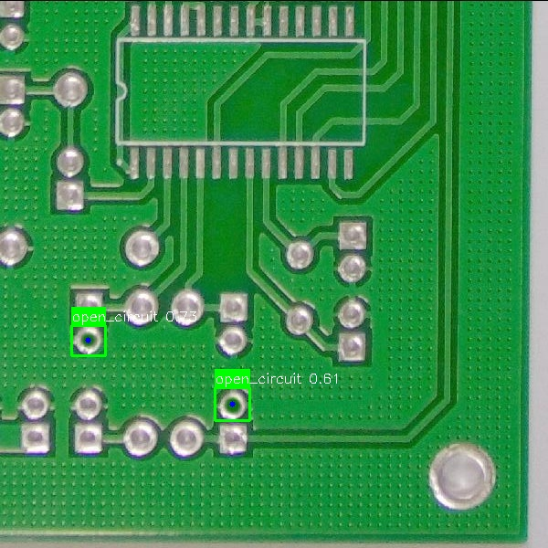

# Automated PCB Quality Inspection System 🏭

## Project Overview
This project implements a computer vision solution to detect and classify manufacturing defects on Printed Circuit Boards (PCBs). Using a custom-trained **YOLOv8** model, the system identifies 6 distinct defect types (e.g., Missing Hole, Mouse Bite, Open Circuit) with **98.3% accuracy**.

## Features
- **Defect Detection:** Identifies defects like Open Circuits, Shorts, and Spurs.
- **Severity Assessment:** logic calculates defect severity (Minor/Critical) based on defect area.
- **Localization:** Outputs precise (x, y) coordinates of defect centers.
- **Performance:** mAP@50: 0.983

## Visuals

